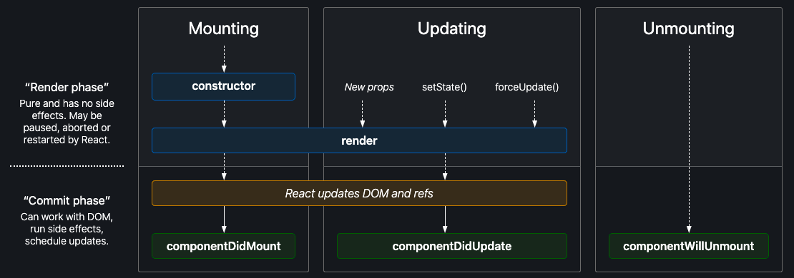

# react-native-interview-questions

<h1>Questions</h1>

### Introductory Questions
<p>The idea behind this first set of questions is to know if the developer have had a contact with the technology and that it's comfortable with the core concepts of React/React Native.</p>

| #id | Question                                                                                                                                                                                                            |
|:---:|:--------------------------------------------------------------------------------------------------------------------------------------------------------------------------------------------------------------------|
|  1  | [What is React Native?](#what-is-react-native)                                                                                                                                                                      |
|  2  | [What are the difference between React Native and React?](#what-are-the-difference-between-react-native-and-react)                                                                                                  |
|  3  | [What are the main characteristics of React Native?](#what-are-the-main-characteristics-of-react-native)                                                                                                            |
|  4  | [Do you know any other tools similar to React Native? If so, mention some pros and cons](#do-you-know-any-other-tools-similar-to-react-native?-if-so,-mention-some-pros-and-cons)                                   |
|  5  | [What is JSX?](#what-is-jsx?)                                                                                                                                                                                       |
|  6  | [What are the Components? Please name the different types.](#what-are-the-components?-please-name-the-different-types.)                                                                                             |
|  7  | [What are Props?](#what-are-props?)                                                                                                                                                                                                |
|  8  | [What is State?](#what-is-state?)                                                                                                                                                                         |
|  9  | [What is the ScrollView used for?](#what-is-the-scrollview-used-for?)                                                                                                                                                           |
| 10  | [What are the List Views? Name the two most common implementations of List Views in RN.](#what-are-the-list-views?-name-the-two-most-common-implementations-of-list-views-in-rn.)                                                                                                                |
| 11  | [Name the two main approaches to creating Platform Specific Code. Please Specify when you would use each](#name-the-two-main-approaches-to-creating-platform-specific-code.-please-specify-when-you-would-use-each)                                                                                      |
| 12  | [To which platforms can a React Native application be compiled?](#to-which-platforms-can-a-react-native-application-be-compiled?)                                                                                                                                     |
| 13  | [What are Life Cycles Methods? Enumerate the most used ones and describe what each of them does](#what-are-life-cycles-methods?-enumerate-the-most-used-ones-and-describe-what-each-of-them-does)                                                                                                                          |
| 14  | [What are Hooks? Enumerate the most commonly used and describe what each of them does](#what-are-hooks?-enumerate-the-most-commonly-used-and-describe-what-each-of-them-does)                                                                                                                                |
| 15  | [How can React Native perform network requests?](#how-can-react-native-perform-network-requests?)                                                                                                           |
| 16  | [How can a React Native application be debugged?](#how-can-a-react-native-application-be-debugged?)                                                                                                                                  |
| 17  | [Does react native provides navigation tools?](#does-react-native-provides-navigation-tools?)                                                                                                                                               |
| 18  | [How are Styles handled in React Native?](#how-are-styles-handled-in-react-native?)                                                                                                                                                    |
| 19  | [What is the Async Storage?](#what-is-the-async-storage?)                                                                                                                                                                 |
| 20  | [What animation systems are provided by React Native?](#what-animation-systems-are-provided-by-react-native?)                                                                                                                                       |

### Intermediate Level Questions

|  #  | Question                                                                                                                              |
|:---:|:--------------------------------------------------------------------------------------------------------------------------------------|
|  1  | [Does React Native works with any syntax transformer by default? if it does which do you think is the reason?](#what-is-react-native) |
|  2  | [Name the main characteristics of React Navigation and React Native Navigation](#what-is-react-native)                                |
|  3  | [What are Error Boundaries? What kind of errors can not be caught with this type of component?](#what-is-react-native)                |
|  4  | [What are common ways to optimize a Flat List?](#what-is-react-native)                                                                |
|  5  | [What type of tests can be performed on React Native?](#what-is-react-native)                                                         |
|  6  | [How many times is the useEffect Hook called by default?](#what-is-react-native)                                                      |
|  7  | [What is a HOC? In which scenarios are a good idea to implement one?](#what-is-react-native)                                          |
|  8  | [What is the Render Props pattern? When should you use it?](#what-is-react-native)                                                    |
|  9  | [What](#what-is-react-native)                                                                                                         |
| 10  | [What are Native Modules?](#what-is-react-native)                                                                                     |
| 11  | [What are Native Components?](#what-is-react-native)                                                                                  |
| 12  | [Does React Native supports accessibility? What tools are provided to the developers?](#what-is-react-native)                         |
| 13  | [Name the 3 core concepts of Redux](#what-is-react-native)                                                                            |
| 14  | [Describe the information flow in Redux](#what-is-react-native)                                                                       |
| 15  | [What is Redux Toolkit?](#what-is-react-native)                                                                                       |
| 16  | [What is Mobx?](#what-is-react-native)                                                                                                |
| 17  | [What is GraphQL?](#what-is-react-native)                                                                                             |
| 18  | [What is React Query?](#what-is-react-native)                                                                                         |
| 19  | [What is Reanimated2?](#what-is-react-native)                                                                                         |
| 20  | [What is Lottie React Native?](#what-is-react-native)                                                                                 |

### Advanced Questions

|  #  | Question                                                                                                                              |
|:---:|:--------------------------------------------------------------------------------------------------------------------------------------|
|  1  | [What is the New Architecture on React Native?](#what-is-react-native)                                                                |
|  2  | [What is the InteractionManager? What are common scenarios to implement it?](#what-is-react-native)                                   |
|  3  | [How do you create Native Modules?](#what-is-react-native)                                                                            |
|  4  | [How do you create Native Components?](#what-is-react-native)                                                                         |
|  5  | [What is Headless Js and which are common uses for it?](#what-is-react-native)                                                        |
|  6  | [What approach can you take to find a memory leak?](#what-is-react-native)                                                            |


### What is React Native?
- React Native is an open source framework for building Android and iOS applications using React and the app platform’s native capabilities. With React Native, you use JavaScript to access your platform’s APIs as well as to describe the appearance and behavior of your UI using React components: bundles of reusable, nestable code.
- Created by Meta and liberated to the public in the year 2015.

### What are the difference between React Native and React?
- While the js library React is meant to be use as a tool to develop web applications the framework React Native is used to build Android and IOS applications.
- React is a fundamental part of React Native, but the inverse is not true.
- In React Js components are compiled to HTML elements while in React Native are converted to native components on each platform.

### What are the main characteristics of React Native?
- Is Multiplatform, officially maintained by Meta for Android and IOS, and by third parties for Windows and Web.
- Most of the code is written in JavaScript and rendered with native code, enabling web developers to rapidly create applications with native platform UI.
- On top of supporting building for multiple platforms it allows to share most of the code between those platforms, meaning that most applications will share near 85% of business logic and UI code between IOS and Android.
- Rapid development experience, thanks to the Fast Refresh there's no need to wait to see the changes like happens for example with native builds.

### Do you know any other tools similar to React Native? If so, mention some pros and cons
- Flutter and Ionic 

### What is JSX?     
- JSX stands for JavaScript XML, is basically a syntax extension to JavaScript and allows us to create components inside JS by providing a syntactic sugar for the React.createElement function.
    ```jsx
    const element = (
      <Text>
        Hello, world!
      </Text>
    )
    const element = React.createElement(
      'Text',
      [],
      'Hello, world!'
    );
    ```
- React needs to be on scope to be able to utilize JSX.
    ```jsx
  import React from 'react';
  ```
- Babel compiles JSX down to React.createElement() calls.
- It provides an easy and visual syntax to set an elements children, we just need to wrap the children/s between the opening and closing tags of the parent.
  ```jsx
  const element = (
  <Parent>
    <ChildrenOne>Hello!</ChildrenOne>
    <ChildrenTwo>Good to see you here.</ChildrenTwo>
  </Parent>);
  ```

### What are the Components? Please name the different types.
- Conceptually, components are like JavaScript functions. They accept arbitrary inputs (called “props”) and return React elements describing what should appear on the screen.
- Components let you split the UI into independent, reusable pieces, and think about each piece in isolation.
- There are two types ways to build a components, it can be a Functional Component(FN) or a Class Component(CC), in the past if you wanted to for the component to have internal state CC were the only option, in the present (thanks to React Hooks) you chose either.
  ```jsx
  // Functional Component
  function CustomGreetingFC(props) {
    return <Text style={styles.greetingText}>Hello, {props.name}</Text>;
  }
  
  //Class Component
  class CustomGreetingCC extends React.Component {
    render() {
        return <h1>Hello, {this.props.name}</h1>;
    }
  }
  ```
- React also provides a third type of Component, or a subtype of CC if you will, called Pure Component (PC). That is meant to be used in cases where the performance is a requirement. As long as the component’s render() function renders the same result given the same props and state, you can use React.PureComponent for a performance boost in some cases.
  ```jsx
  class CustomGreetingPC extends React.PureComponent {
    render() {
        return <h1>Hello, {this.props.name}</h1>;
    }
  }
  ```
- React Native offers several core components like View, Text, Image, etc. But you also can create your own custom components or use the ones created by the community.
### What are Props?
- When React sees an element representing a user-defined component, it passes JSX attributes and children to this component as a single object. We call this object “props”.
- An easy way to describe this concept is that Props are to React Components what arguments are to JavaScript Functions.
- Props are read-only, a Component never should change the value of the properties that receives.
- Everytime that a prop value is updated by a parent component the child will rerender unless we specifically prevent it.
- We can set  default values for Props by setting defaultProps, and those values are going to be use for undefined props (but not for null props).
```jsx
  // Functional Component
  function CustomGreetingFC(props) {
    return <Text style={styles.greetingText}>Hello, {props.name}</Text>;
  }
  CustomGreetingFC.defaultProps = {
    name: 'User'
  }
  
  //Class Component
  class CustomGreetingCC extends React.Component {
    render() {
        return <h1>Hello, {this.props.name}</h1>;
    }
  
    static defaultProps = {
        name: "User",
    }
  }
  ```
### What is State?
- In a similar fashion as the Props, State is a mechanism to hold information on a Component that in case to be updated it will trigger a rerender, but it's intern and controlled by the Component itself.
- In the past only CC could use this mechanism, but in RN 0.59 hooks were introduced allowing FC to have their own way to handle State.
- The State can't be updated directly, instead `this.setState` for CC and the setter function returned by `useState` for FC are needed.
- The State updates are not always run instantly, they may be asynchronous since React waits for the most efficient moment to update the state, it's possible that several calls to update the state will be executed in a batch.
- The changes in the state are merged, meaning that if we have a complex state in a component and we only update a part the rest of the state won't be touched, just the intended part.
### What is the ScrollView used for?
- The ScrollView is a scrolling container meant to be used to hold a small set of heterogeneous elements that can't be displayed entirely in the height or width of the screen.
- It can be use vertically or horizontally.
- TODO: CODE E.G.
### What are the List Views? Name the two most common implementations of List Views in RN.
- List Views are the tools that we have to render a scrollable medium/big set of homogenous items, like a list of cards, photos, etc.
- Currently, the two most common List Views that we utilize are FlatList and SectionList
- FlatList is a performant scrollable list that requires at the minimum to set two properties `data` and `renderItem`, data expects the array of items to be displayed and renderItem a function that returns a component that will be rendered for each element of the array.
- Section list is similar to the FlatList, but it will require a property called `sections` instead of `data` and an extra property called `renderSectionHeader`, sections expects Array<{title:string, data: Array<T>}> while renderHeader expects a function to know how to render each of the section headers. 
### Name the two main approaches to creating Platform Specific Code. Please Specify when you would use each
- The two alternatives that RN provides to write Platform Specific Code are the <b>Platform Module<b> and the </b>platform-specific file extensions</b>.
- The Platform Module is meant to be use when small blocks of logic need to be run in a particular platform, the module offers a way to know on which platform the application is running and this can be used in conditional statements.
- On the other hand, the second approach is generally utilized when there's too much logic to split between IOS and Android and therefore almost none that can be shared. Files can be created with the platform name as part of the extension, e.g. CustomGreetingFC.ios.js/CustomGreetingFC.android.js, also since RN can load the corresponding file automatically there's no need to mention the extension at the moment of requiring the Component.
### To which platforms can a React Native application be compiled?
- React Native allows developers to create applications for Android, IOS, macOS(supported by MS), Android TV, Windows(supported by MS) and Web(react-native-web).
### What are Life Cycles Methods? Enumerate the most used ones and describe what each of them does
- These methods are the tool that React provides for us to introduce logic at certain points of the life of a Component, these points can be grouped in three sets, 1.Mounting, 2. Updating and finally 3.Unmounting.
  
- The methods that we have access to in the <b>Mounting</b> period are: `constructor`, `render` and `componentDidMount`.
  1. The <b>constructor</b> allow us to initialize the state and bind event handler methods to an instance.
  ```ecmascript 6
  constructor(props){
    super(props);
    this.setState = { 
        displayModal: false,
    }
    this.handleOpenModal = this.handleOpenModal.bind(this);
  }
  ```
  2. The <b>render</b> method is the only required to be implemented in our components, based in the components props and state it will return a React Element, Strings, Numbers, Booleans or even `null`.
  3. <b>componentDidMount</b> it's called third in the mounting process after the component is inserted in the tree, is normally where API calls are made and where the initial state that can't be initialized in the constructor is set, is also a proper place to place subscriptions.
- On the Updating subset we have `render` and `componentDidUpdate`.
  1. We already discussed <b>Render</b>, since it's also called in the mounting period, this method is obviously also called when there are new props, when the state is updated or when the `forceUpdate()` method is invoked.
  2. <b>ComponentDidUpdate</b>, this one is called after an update, it's not involved in any of the other periods. The method receives the previous state and props as its arguments, so we can react to the changes in the information and act upon those changes. It's important that if the state is modified inside this method we do it conscientiously, wrapping the `setState` invocation inside a condition where the previous and current state/props should be checked, if we don't do this an infinite loop could be generated.
  ```jsx
  componentDidMount(){
      const persona = api.fech('persona');
      this.setState(persona);
  }
  
  // We need to be carefull while calling this.setState inside componentDidUpdate to prevent loops.
  componentDidUpdate(prevProps, prevState){
      if(this.state.persona.id !== null && prevState.persona.id !== this.state.persona.id){
          const photo = api.get(`www.photo.com/this.state.persona.id`);
          this.setState.photo = photo;
      }
  }
  
  const [persona,setPersona] = useState(null);
  const [photo, setPhoto] = useState(null);
  
  useEffect(()=>{
      const photo = api.get('testest');
      setPhoto(photo);
  },[persona.id])
  
  ```
- Finally, we have the method <b>componentWillUnmount</b> that belongs to the Unmounting process, which it will be called just before the component is unmounted and destroyed, this provides us with the opportunity to unsubscribe to listeners, cancel requets, and any other cleaning tasks that we need to do before the component is gone.
### What are Hooks? Enumerate the most commonly used and describe what each of them does                                           
- Hooks are functions that allow us to use features from React in FC that in the past were only available for CC.
- The main problem that hooks aim to tackle is the lack of a way to share reusable behavior between components.
- The most used hooks are `useState`, `useEffect`, `useContext`, `useCallback`, `useRef`, and `useMemo`.
  1. <b>UseState</b> enables the usage of state inside FC, its invocation returns a piece of state and the corresponding function to update said state.
  2. <b>UseEffect</b> can be seen as the fusion of `componentDidMount` and `componentDidUpdate`, this hook expects 2 args, a function with the logic that we want to run and an array of dependencies that will trigger the function once one or more are updated.
  3. <b>UseContext</b> basically allow us to access to context values while writing FC. `useContext` receives the context object itself as argument.
  4. <b>UseCallback</b>, this hook memoized functions to prevent creating new ones when the component is updated, but it has a catch, we need to add any value that could change as a dependency to prevent running calculations with stale information.
  5. <b>UseMemo</b> is used to memoized values that are expensive to compute, in the same fashion that useCallback it takes 2 parameters, the function to calculate the value and the array of dependencies necessary to do it.
  6. <b>UseRef</b> allow us to use references inside a FC, and therefore controlling a component in an imperative way.
  7. <b>UseReducer</b> works identically similary to a reducer in redux, the hook expects the reducer and an initial state and returns the state and the dispacher function, it's an alternative to useState for when the state logic is complex or when it dependens on the previous state to update the next one, it's also helpful if you have to triger updates inside the decendents, instead of passing callbacks the dispatch function can be shared. 
  ```jsx
  const [cost, setCost] = useState(0);
  
  const handleCalculateOnPress = useCallback(()=>{
    const finalCost = cost * 1.21;
    setCost(finalCost);
  },[cost])
  ```
### How can React Native perform network requests?
- The framework provides a networking tool, the Fetch API, which allow us to make requests in the same fashion that we would do with XMLHttpRequest. The API handles both, a generic definition of `request` object and a generic definition of `response` object.
- The `fetch()` method receives 2 arguments, the first is the URL and the second one is <b>options</b> an object that allow us to customize the request.
- Since the networking operations are inherently asynchronous the use of promises or the async/await syntax.
- Fetch is the built in option but it's possible to use other tools, like [axios](https://github.com/axios/axios).

### How can a React Native application be debugged?
- First of all, you can access to the Remote JS debugging option in the developer menu, enabling this option is required by all the developer tools that can help us to debug an issue.
- By default React Native will display warning an errors through the application itself and the console where metro is running. In the application such messages will be displayed as notifications.
- To debug JS code there are a couple of alternatives, being the most basic ones Chrome Developer Tools and Safari Developer Tools and the most advanced ones: [react dev tool](https://github.com/facebook/react/tree/main/packages/react-devtools), [react native debugger](https://github.com/jhen0409/react-native-debugger), [flipper](https://fbflipper.com/docs/features/react-native/), and [reactotron](https://github.com/infinitered/reactotron). Most of this tools allow us to inspect network requests, the component tree, performance, redux actions and the store state, they also allow us to set breakpoints so we can evaluate the state of variables and follow the execution flow.

### Does react native provides navigation tools? 
- There are several tools to handle navigation in the React Native scene, but two are the most popular ones, React Navigation which is recommended when you're starting with the navitation, and [React Native Navigation](https://github.com/wix/react-native-navigation) which is recommended if you are integrating RN into an application that handles the navitgation natively.
### How are Styles handled in React Native?
- When we talk about Styles in React Native the first concept that comes up is the module StyleSheet, that is similar to CSS StyleSheets. It allow us to keep the styles away from the render method and to attatch names that are meaninful to us to the components.
- The two most used methods that provide the StyleSheet module are : 1) `create()` that as the name indicates, creates an StyleSheet referrence from the object passed as argument and 2) `compose()`, that take 2 styles and merge them, in the same fashion that CSS the latest style takes precedence if a property is present in both objects.
- Both, styles created inline and Styles created using the StyleSheet Module are give to the core components through the property `style` (singular).
- The stylesheet is sent only once over the bridge unlike normal style object inside render() that are passed every time.
### What is the Async Storage?
- In the past, this was a module provided by the core of React Native, but to alleviate the workload of the core team it has been deprecated. In the present there are several libraries available in the community that allow developers to have a local storage.
- The most used library to achieve this is currently [React Native Async Storage](https://react-native-async-storage.github.io/async-storage/).
- Is an unencrypted, asynchronous, persistent, key-value storage system that is global to the app.

### What animation systems are provided by React Native?      
- Animations are a pain point for React Native but through the two available API built in we have a way to create simple animations for our applications.
- The two systems are the <b>Animated API</b>, meant to be used for focused control over specific values and <b>LayoutAnimation API</b> for more general layout transactions. 

###  [ ⬆ Back to Introductory Questions ](#introductory-questions)

### Does React Native works with any syntax transformer by default? if it does which do you think is the reason?
- React Native ships by default with Babel.
- Since the JavaScript code in our RN applications will be executed in different environments, i.e. Hermes, JavaScriptCore, V8, etc, it makes sense to use a syntax transformer to be able to use 
the newest syntax without having issues with any the of the interpreters.

### Name the main characteristics of React Navigation and React Native Navigation
<b>React Navigation:</b>

- It is a JavaScript-based library for routing and navigation in React Native apps.
- It offers a customizable stack navigator, tab navigator, and drawer navigator.
- It is built and maintained by the React Native community.
- Its current versions is 6.x

<b>React Native Navigation:</b>

- It is a native navigation library for React Native, meaning it uses native navigation components rather than JavaScript-based ones.
- It provides performance improvements compared to JavaScript-based libraries.
- It is built and maintained by Wix, a company that also maintains other React Native libraries such as react-native-ui-lib.
- Its current version is 7.x

### What are Error Boundaries? What kind of errors can not be caught with this type of component?
- Error boundaries are React components that are able to catch errors in their child component tree, log those errors and display a fallback UI.
- Errors in the following context can't be captured:
  - Event handlers.
  - Asynchronous code(e.g. setTimeout).
  - In the Error Boundary itself.
  - Native code.
- An ErrorBoundary component needs to be created using a Class and it should implement 3 life cycle methods:
  - static <b>getDerivedStateFromError</b> where the hasError state should be updated and <b>componentDidCatch</b> where any log service can be called and finally 
the render method, where some conditional rendering logic needs to be in place in order to return the fallback UI instead of the broken tree.

### What are common ways to optimize a Flat List?
- Leverage the virtualization of the FlatList to only render the items that are currently on the screen, setting up the <b>getItemLayout</b> and <b>initialNumToRender</b> properties helps to
achieve this. 
- Use a stable and unique key on each item item.
- Set the <b>maxToRenderPerBatch</b> prop to a reasonable number.
- Make the logic and components as simple as possible inside the <b>renderItem</b> prop.
- Use the InterationManager to wait until the first render in order to start rendering the FlatList component.

### What type of tests can be performed on React Native?
- There are several types of tests that can be performed on React Native applications, including:
 - Unit tests, which test individual functions or components in isolation
 - Snapshot tests, which compare the rendered output of a component to a saved version
 - Integration tests, which test the interactions between multiple components or the integration of the app with external APIs
 - End-to-end tests, which test the app as a whole by simulating user interactions.
- Jest, Enzyme, Detox and React Native Testing Library are popular testing frameworks used in React Native development.

### How many times is the useEffect Hook called by default?
- This hook will be called by default every time the component is re-rendered.
- If the dependency array is empty, it will run once after the component is mounted.
- Conversely, if dependencies are provided, the hook will be called every time
  a dependency value is changed.
- Finally, if we had been talking about React instead of React Native, the hook renders twice even if the array of dependencies
  is empty, that is, if Strict Mode is enabled. This happens so React can look for functions that are not being cleared correctly.

### What is a HOC? In which scenarios are a good idea to implement one?
- A Higher Order Component (HOC) is a design pattern in React that allows for code reuse by wrapping a component in another component. 
- A HOC is a function that takes a component as an argument and returns a new component. It's a way to reuse component logic.
- HOCs are useful in scenarios where you need to reuse component logic across multiple components.
- Most of these scenarios are now covered by hooks but there's still a few cases where HOC's are the way to go, i.e. When we need to wrap a
component with a Provider, like Redux, Mobx, etc and when we want to share templates.
